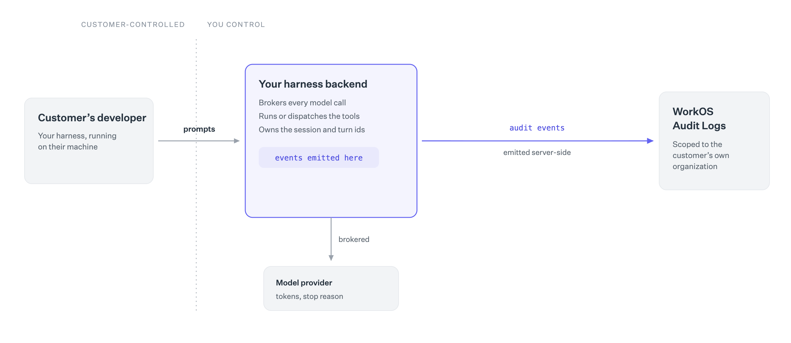

# workos-audit-harness

<p align="center">
  
</p>

Audit logging for AI coding agents: one event vocabulary, six working integrations, and an honest account of where each place you can emit from tops out.

**If you build an agent harness, emit audit events from your own backend.** Your servers already see the session, the model, and every tool call the agent makes, and a customer's developer cannot rewrite them there. That is the only place an event's *content* can be attested, and it's the architecture we recommend. Start with the guide [Add enterprise-grade audit logs to your AI harness](#add-enterprise-grade-audit-logs-to-your-ai-harness) below and the shared event taxonomy in [`packages/audit-core`](packages/audit-core/src/harness-audit-schemas.mjs).

**If you operate a fleet and your vendors haven't done that yet,** instrument the endpoint instead. The plugins here emit from Claude Code, Codex, OpenClaw, OpenCode, Hermes, and pi today, with no vendor cooperation required. Events are authenticated per device and attributed server-side, but their content is composed on a machine the user administers, so it can be fabricated or withheld; see the [trust model](packages/proxy/README.md#trust-model) before building on the result.

The two compose. A vendor-emitted spine (session, turn, and tool-call ids from the backend) correlated with endpoint-emitted enrichment (repo, branch, `cwd`, device, local approvals) gives you both halves: the backend sees the conversation, the endpoint sees the machine, and claims from one that don't reconcile against the other are detectably false.

This repo contains six agent integrations, a fleet-deployment proxy and a chat console over the resulting audit trail, sharing one CLI harness and one set of audit schemas:

| Package | What it does |
|---|---|
| [`packages/audit-core`](packages/audit-core) | Shared core for every integration: config resolution, the emit/query paths, audit schemas, and the `workos-audit-harness` CLI. |
| [`packages/claude-plugin`](packages/claude-plugin) | Claude Code plugin: emits session/prompt/tool/turn events to WorkOS and exposes a `workos_audit_query` MCP tool. |
| [`packages/codex-plugin`](packages/codex-plugin) | Codex plugin: same lifecycle events + MCP audit query, with Codex's hook model. |
| [`packages/openclaw-plugin`](packages/openclaw-plugin) | OpenClaw plugin: emits native session/message/agent/LLM/tool/turn events and exposes WorkOS audit query/status tools. |
| [`packages/opencode-plugin`](packages/opencode-plugin) | OpenCode plugin: emits session/prompt/tool/permission/turn events via native hooks and exposes WorkOS audit query/status tools. |
| [`packages/hermes-plugin`](packages/hermes-plugin) | Hermes Agent plugin: Python hooks shell out to bundled Node scripts to emit session/prompt/tool/approval/subagent/turn events, plus audit query/status tools. |
| [`packages/pi-extension`](packages/pi-extension) | Extension for [pi-coding-agent](https://github.com/mariozechner/pi) and the `workos-audit-harness` CLI. |
| [`packages/proxy`](packages/proxy) | Cloudflare Worker ingestion proxy: laptops authenticate with a device cert over mTLS instead of carrying a WorkOS API key. Deployable to any Cloudflare account. |
| [`packages/chat`](packages/chat) | AuthKit-gated AI chat console over the audit trail: ask "who ran bash commands yesterday?" and the model answers from the Audit Logs Export API. |
| [`packages/site`](packages/site) | Marketing & docs site (Next.js 15 + Tailwind v4). It also hosts the `workos-audit-recipe` SKILL.md. |

## Install

### Quick install (all agents at once)

```bash
npx github:workos/workos-audit-harness
```

The installer detects which supported agents are on your machine (pre-selected in the picker) and installs the audit plugin for each one you confirm, so you don't repeat the setup per agent. Non-interactive: `--yes` installs for everything detected, `--agents claude,codex` picks explicitly, `--list` just shows what's detected. From a clone, the same thing is `npm run quick-install`.

Prefer manual setup, or need the details for one agent? The per-agent sections below are what the installer automates.

### Claude Code

```text
/plugin marketplace add workos/workos-audit-harness
/plugin install workos-audit@workos-audit-plugins
```

Then restart Claude Code and run `/workos-audit-setup` to wire up credentials. See [packages/claude-plugin/README.md](packages/claude-plugin/README.md).

### Codex

```bash
git clone https://github.com/workos/workos-audit-harness.git
cd workos-audit-harness
codex plugin marketplace add .
```

Install `workos-audit` from the marketplace inside Codex, then restart. See [packages/codex-plugin/README.md](packages/codex-plugin/README.md).

### OpenClaw

```bash
git clone https://github.com/workos/workos-audit-harness.git
cd workos-audit-harness/packages/openclaw-plugin
npm install
npm run bundle
openclaw plugins install .
openclaw plugins enable workos-audit
```

Restart the OpenClaw gateway after installing or updating the plugin. See [packages/openclaw-plugin/README.md](packages/openclaw-plugin/README.md).

### OpenCode

```bash
git clone https://github.com/workos/workos-audit-harness.git
cd workos-audit-harness
npm install
npm run bundle -w @workos-inc/opencode-audit-plugin
mkdir -p ~/.config/opencode/plugins
cat > ~/.config/opencode/plugins/workos-audit.js <<JS
export * from '$(pwd)/packages/opencode-plugin/dist/index.mjs';
JS
```

OpenCode only scans `.ts`/`.js` files in its `plugins/` directory, so the one-line shim re-exports the bundled `.mjs` entry. If you set `XDG_CONFIG_HOME` (or `OPENCODE_CONFIG_DIR`), write the shim under `$XDG_CONFIG_HOME/opencode/plugins` (or `$OPENCODE_CONFIG_DIR/plugins`) instead of `~/.config/opencode/plugins`. Restart OpenCode after installing or updating the plugin. See [packages/opencode-plugin/README.md](packages/opencode-plugin/README.md).

### Hermes Agent

```bash
git clone https://github.com/workos/workos-audit-harness.git
cd workos-audit-harness
npm install
npm run bundle -w @workos-inc/hermes-audit-plugin
mkdir -p ~/.hermes/plugins
ln -s "$(pwd)/packages/hermes-plugin" ~/.hermes/plugins/workos-audit
hermes plugins enable workos-audit
```

Restart Hermes after installing or updating the plugin. See [packages/hermes-plugin/README.md](packages/hermes-plugin/README.md).

### pi-coding-agent

```bash
git clone https://github.com/workos/workos-audit-harness.git
cd workos-audit-harness
npm install
```

Register `packages/pi-extension/index.ts` with pi. See [packages/pi-extension/README.md](packages/pi-extension/README.md).

## Configure WorkOS credentials

The plugins and the pi extension all share the same config story. Easiest path:

```bash
npm run workos-auth-login
```

This runs the WorkOS CLI login flow. If no organization is set, an `Audit Log Harness` org is found or created automatically.

Alternatively set `WORKOS_API_KEY` and `WORKOS_ORGANIZATION_ID` env vars.

### No WorkOS account yet? (zero-account quickstart)

You can run the harness cold, before signing up. Provision an **unclaimed environment**, real credentials minted without an account:

```bash
npm run audit-harness -- provision      # or: npx -y workos@0.21.0 env provision
```

The WorkOS CLI stores the credentials (including the claim token) in its own config store, and the harness picks the environment up automatically, exactly like a logged-in CLI environment. The Claude plugin's `/workos-audit-setup` wizard offers the same thing interactively when it finds no credentials.

Things to know about unclaimed environments:

- **Nobody owns one until it is claimed.** Link it to a real WorkOS account with `npx -y workos@0.21.0 env claim`. The claim token lives only in the local WorkOS CLI config, so losing that machine (or removing the env) permanently orphans the environment and its data.
- **They never override real credentials.** `WORKOS_API_KEY`, harness config, and MDM-managed keys all outrank the CLI's active environment, and `provision` refuses to run when any credential already exists (`--force` provisions an additional env anyway).
- **Provisioning is always explicit.** Only the `provision` command and the setup wizard mint environments; hooks, event emission, and CI paths never do.
- `status` reports `unclaimedEnvironment: true` plus a claim reminder while events target one.

### Fleet rollout (no key on laptops)

For rolling out to a whole fleet, don't put API keys on laptops at all. Instead, deploy the [ingestion proxy](packages/proxy) to your Cloudflare account and push its URL to every device via your MDM (a machine-wide config file at `/Library/Application Support/workos-audit/config.json` on macOS). Laptops authenticate with a device certificate over mTLS; the proxy holds the key and attributes events server-side. The mTLS client path is currently **macOS-only** (it relies on the keychain and Secure Transport curl); other platforms fall back to API-key/CLI transport. See [packages/proxy/README.md](packages/proxy/README.md).

To force-install the Claude Code plugin itself on every device (managed settings via the Claude.ai admin console or MDM), see [Enforce the plugin fleet-wide](packages/claude-plugin/README.md#enforce-the-plugin-fleet-wide-managed-settings).

Before building on the resulting log, read the proxy's [trust model](packages/proxy/README.md#trust-model). Events are device-attested claims about harness activity: the proxy proves which authenticated device sent an event and stamps the actor server-side, but the event body is asserted by a machine its user administers, so it can be fabricated or withheld. Treat event content as untrusted input downstream.

## Self-check from your shell

The `workos-audit-harness` CLI in `packages/audit-core` is the shared core for all integrations. From the repo root:

```bash
npm run audit-harness -- status              # show api-key / WorkOS CLI credential state
npm run audit-harness -- auth-login          # delegate to `workos auth login`
npm run audit-harness -- provision           # mint an unclaimed environment (no account needed)
npm run audit-harness -- ensure-organization # find or create the harness org
npm run audit-harness -- query --help        # export & summarize audit logs
```

If you only need the WorkOS CLI's own view of your auth (no harness config), run `npx -y workos@0.21.0 auth status --mode agent` from any shell. This is what the plugin's `/workos-audit-setup` reflects under `workosCli.loggedIn`.

## Seed audit schemas

The generic harness schemas work across every integration:

```bash
npm run create:harness-schemas -- --prefix=claude    # or codex, pi, ...
```

Per-integration legacy schemas are still available:

```bash
npm run create:claude-schemas
npm run create:codex-schemas
npm run create:openclaw-schemas
npm run create:opencode-schemas
npm run create:hermes-schemas
```

## Repository layout

```
.
├── .claude-plugin/marketplace.json       # Claude Code marketplace manifest (points at packages/claude-plugin)
├── .agents/plugins/marketplace.json      # Codex marketplace manifest (points at packages/codex-plugin)
├── packages/
│   ├── audit-core/                      # shared config/emit/query core + workos-audit-harness CLI
│   ├── claude-plugin/
│   ├── codex-plugin/
│   ├── hermes-plugin/
│   ├── openclaw-plugin/
│   ├── opencode-plugin/
│   ├── pi-extension/
│   ├── proxy/                           # mTLS ingestion proxy (Cloudflare Worker + D1)
│   ├── chat/                            # audit chat console (React Router 7, Cloudflare Workers + D1)
│   └── site/                            # audit-harness.workos.dev (Next.js, deploys to Vercel)
└── package.json                          # npm workspaces root
```

npm workspaces handles dependency installation; there is no separate build step. Each package has its own `package.json` and is independently usable. The one exception is `packages/chat`, which is deliberately **not** a workspace member: it keeps its own `package-lock.json` (vendored WorkOS design system + React Router toolchain), so run `npm ci` inside that directory rather than from the root.

## Audit chat console

[`packages/chat`](packages/chat) is an AuthKit-gated AI chat console over the audit trail this harness produces: ask "who ran bash commands yesterday?" and the model answers from the WorkOS Audit Logs Export API. It reuses the proxy's tenant secrets, so it reads the same WorkOS environment the proxy ingests into, and it deploys to Cloudflare Workers alongside the proxy.

## Add enterprise-grade audit logs to your AI harness

AI products increasingly look less like a single API call and more like a *harness*: a runtime that accepts user input, chooses a model, invokes tools, runs shell commands, reads and writes files, asks for approval, and produces an answer over multiple turns.

That lifecycle is powerful. It is also exactly the kind of activity enterprise customers want to audit. If a customer asks, "Who ran this command?", "Which user changed this file?", or "What model and tools were used during this investigation?", the answer should not depend on grepping application logs. It should be available as structured, organization-scoped audit events that can be exported, filtered, and explained.

WorkOS Audit Logs gives you the building blocks for that. Most AI harnesses already expose hooks around the agent lifecycle. By mapping the right hooks into WorkOS Audit Logs, you can add enterprise-grade auditing to your AI product without building an audit log system from scratch.

### What is an audit log?

An audit log is a structured record of something meaningful that happened in your application. A useful audit event answers five questions: **who** did it (the actor), **what** they did (the action), **what was affected** (the target), **when** it happened, and **where and with what context** (IP, user agent, organization, metadata).

> Jonatas signed in to Linear.

In audit log terms: actor `user:jonatas`, action `user.signed_in`, target `application:linear`, occurred at `2026-05-12T10:15:00Z`, plus context. For an AI harness the same pattern applies: "the agent called the `bash` tool in session `sess_123`" still has the shape of actor, action, target, timestamp, and metadata. The difference is that the targets are harness-native objects: sessions, prompts, tools, commands, files, models, approvals, and exports.

### Why AI harnesses are a natural fit

A typical SaaS application has explicit controller actions like "create project" and "delete user". An AI harness has a more dynamic lifecycle, but it is still full of auditable moments: a user submits a prompt, the harness starts an agent run, the model chooses tools, the harness executes them, the agent writes files or runs commands, the user approves or denies an action, the agent completes or fails, and the customer exports logs later to investigate.

Most harnesses already expose hooks for these moments: `onPrompt`, `beforeAgentStart`, `onToolCall`, `onToolResult`, `onSessionEnd`, `PreToolUse`, `PostToolUse`. The integration point already exists. The task is to decide which hooks are audit-worthy, define schemas for them, and emit Audit Log events when they happen.

### Step 1: Decide which lifecycle events are worth auditing

Not every hook belongs in an audit log. Audit logs should capture events that are meaningful for security, compliance, customer support, or incident investigation, not every streamed token, UI render, retry loop, or heartbeat. A good starting set:

| Harness event | Action | Why it matters |
|---|---|---|
| Session started | `agent.session.started` | Establishes the beginning of an auditable interaction. |
| Session ended | `agent.session.ended` | Marks session closure and reason. |
| Prompt submitted | `agent.prompt.submitted` | Records that a user initiated work. |
| Agent run started | `agent.run.started` | Captures the start of a model-driven operation. |
| Agent run completed | `agent.run.completed` | Captures duration, status, and outcome. |
| Tool call started | `agent.tool.called` | Shows which external capability the agent attempted to use. |
| Tool call completed | `agent.tool.completed` | Shows whether the tool succeeded and how long it took. |
| Tool call failed | `agent.tool.failed` | Useful for incident review and debugging. |
| Shell command executed | `agent.command.executed` | High-value event for security review. |
| Model selected | `agent.model.selected` | Useful for understanding model usage and policy decisions. |
| Approval granted/denied | `agent.approval.granted` | Shows when a human authorized sensitive behavior. |
| File changed | `agent.file.changed` | Answers "who changed this file?" in agent workflows. |
| Audit export created | `agent.audit_export.created` | Audits access to the audit trail itself. |

Just as important: decide what *not* to log. Raw prompts and tool outputs can contain secrets, customer data, or source code. A safer default is metadata: prompt length, a SHA-256 hash, an optional truncated preview, tool name, input/output byte size, command hash, duration, and success/failure. That gives investigators evidence without turning your audit logs into a second data lake of sensitive content.

### Step 2: Model actors, actions, and targets

WorkOS Audit Logs events are organization-scoped. In a B2B SaaS product the WorkOS organization usually maps to your customer. A harness event looks like this conceptually:

```jsonc
{
  "organization_id": "org_01ABC",
  "event": {
    "action": "agent.tool.called",
    "occurred_at": "2026-05-12T10:15:00.000Z",
    "actor": { "type": "user", "id": "user_01ABC", "name": "Jonatas" },
    "targets": [
      { "type": "session", "id": "sess_01ABC" },
      { "type": "tool", "id": "toolu_01ABC", "metadata": { "tool_name": "bash" } }
    ],
    "context": { "location": "203.0.113.42", "user_agent": "my-ai-harness/1.0" },
    "metadata": {
      "tool_name": "bash",
      "input_sha256": "...",
      "input_bytes": 482,
      "command_preview": "npm test",
      "command_truncated": false
    }
  }
}
```

The **actor** is usually the end user, admin, service account, or system process. The **action** is a stable string such as `agent.tool.called`. The **targets** are the affected resources: session, tool, command, model, file, project, or export. The **metadata** contains typed, action-specific details.

### Step 3: Create schemas first

WorkOS Audit Logs validates incoming events against schemas. That is a feature: it prevents your audit trail from becoming inconsistent over time. It also means you should create schemas before you start sending events. An event that does not match a schema is rejected with a validation error.

```typescript
import { WorkOS } from '@workos-inc/node';

const workos = new WorkOS(process.env.WORKOS_API_KEY!);

await workos.auditLogs.createSchema({
  action: 'agent.tool.called',
  targets: [
    { type: 'session' },
    { type: 'tool', metadata: { tool_name: 'string' } },
  ],
  metadata: {
    tool_name: 'string',
    tool_call_id: 'string',
    input_sha256: 'string',
    input_bytes: 'number',
    command_preview: 'string',
    command_truncated: 'boolean',
    blocked: 'boolean',
  },
});
```

This repo defines its schemas as code and seeds them into WorkOS (see [`packages/audit-core/src/harness-audit-schemas.mjs`](packages/audit-core/src/harness-audit-schemas.mjs) and `npm run create:harness-schemas`). Generating schema definitions from your harness's hook list is a great task for an LLM agent; review the proposed action names, targets, and metadata before seeding.

### Step 4: Emit events from harness hooks

Once schemas exist, wire the harness lifecycle hooks:

```typescript
import { WorkOS } from '@workos-inc/node';

const workos = new WorkOS(process.env.WORKOS_API_KEY!);

await workos.auditLogs.createEvent(process.env.WORKOS_ORGANIZATION_ID!, {
  action: 'agent.tool.called',
  occurredAt: new Date(),
  actor: { type: 'user', id: currentUser.id, name: currentUser.name },
  targets: [
    { type: 'session', id: session.id },
    { type: 'tool', id: toolCall.id, metadata: { tool_name: toolCall.name } },
  ],
  context: { location: request.ip, userAgent: request.headers['user-agent'] },
  metadata: {
    tool_name: toolCall.name,
    tool_call_id: toolCall.id,
    input_sha256: sha256(toolCall.input),
    input_bytes: byteLength(toolCall.input),
  },
});
```

Centralize this in a small `emitEvent` helper so individual hooks become one-line mappings from harness event to audit event. See [`packages/pi-extension`](packages/pi-extension) for a complete working example. The same pattern applies to prompts, model changes, session starts, session shutdown, tool results, and user-triggered shell commands.

### Step 5: Emit from your server, not from the endpoint

This is the most consequential decision in the whole integration. There are two reasons to emit server-side. The first is well known; the second determines whether your audit log is evidence or merely testimony.

**Secrets.** WorkOS API calls require an API key, and keys do not belong on machines you do not control. So: the browser or local harness triggers a lifecycle event; your backend authenticates the user and resolves the WorkOS organization ID; your backend emits the event using a server-side API key.

**Integrity.** An audit event composed on a machine its user administers is a *claim*, not a fact. Whoever owns that machine can hand-craft events that never happened, and can stop real ones from being sent at all. No amount of client-side hardening fixes this. Device certificates, code signing, and hardware-backed keys all authenticate *who is sending*; none of them can attest that the content is true, because the content is composed where the attacker already has write access.

> Relaying client-supplied events through your backend solves the key problem and leaves the integrity problem untouched.

The fix is to **compose the event on the server from what your backend already observed**, rather than forwarding what the client reported. You are running the agent loop: your infrastructure issues the tool calls, selects the model, and counts the tokens. Emit from that, and the event becomes something the user cannot fabricate or suppress. This is the single biggest advantage you have as the harness vendor, and it is unavailable to anyone instrumenting your product from the outside.



*Same event vocabulary as the [endpoint tier](packages/proxy/README.md), so the two halves reconcile against each other.*

Some facts genuinely only exist on the endpoint: the working directory, the git repository and branch, whether a human approved a prompt locally. Collect those if they are useful, but keep them in a clearly separate part of the event, and treat them as unverified. A good rule: anything the server observed is a fact, anything the client reported is a claim, and the two should never be indistinguishable to whoever reads the log later.

For internal tools or local-only harnesses with no backend, you can use an environment variable or secret manager directly in the harness process. Treat the key like any other service credential: do not commit, do not print, do not expose to model context. Just be honest in your documentation that events from that deployment are endpoint claims.

### Step 6: Map every event to the right customer

Emitting server-side raises a question that never comes up when a laptop talks straight to the API: your backend serves every customer, so each event has to carry the correct organization, and getting that wrong is worse than not logging at all. An event delivered to the wrong tenant is a data leak, and one delivered to no tenant is invisible.

Resolve the organization from the authenticated session, server-side, on every event. Never accept it from the client, and never infer it from something the user can change, such as an email domain, a workspace name, or a header.

- **One organization per customer.** The mapping usually already exists in whatever you use for SSO or provisioning. Reuse it rather than inventing a second source of truth that can drift.
- **Users who belong to several organizations.** Common with contractors and agencies. Scope the event to the organization whose resources the session actually touched, not to a default the user picked at login.
- **Activity with no customer.** Personal or free-tier usage, internal testing, and your own staff. Decide deliberately where those go; routing them into a customer's log because it was the nearest match is the mistake to avoid.
- **Fail closed.** If the organization cannot be resolved, drop the event to your own error tracking and alert. Do not guess, and do not fall back to a catch-all organization.

If your customers connect their own WorkOS environment rather than living in yours, this becomes a connected-app problem: you are writing into a tenant that grants you access, so you also inherit their retention and residency expectations, which makes this a data-handling decision as much as an engineering one.

### Step 7: Let the agent query the audit trail

Audit logs become even more useful when your harness can answer questions about them: "Who ran `rm -rf` last week?", "Which sessions used the `bash` tool yesterday?", "Who changed the model before the incident?". WorkOS supports creating audit log exports for an organization and date range:

```typescript
const auditExport = await workos.auditLogs.createExport({
  organizationId,
  rangeStart,
  rangeEnd,
  actions: ['agent.tool.called'],
  targets: ['tool'],
});

// Poll with workos.auditLogs.getExport(auditExport.id) until ready.

const response = await fetch(auditExport.url);
const csv = await response.text();
const rows = parseAuditLogRows(csv);

return { rowCount: rows.length, rows: rows.slice(0, 50) };
```

The plugins in this repo expose exactly this flow as a `workos_audit_query` MCP tool: create an export with filters, poll until ready, download and parse the CSV, summarize counts by action/actor/target, and return sample rows so the agent can answer with evidence. That turns WorkOS Audit Logs into both a compliance feature and an operational debugging tool.

### Implementation checklist

- Every emitted action has a WorkOS Audit Logs schema.
- Organization IDs map correctly to customers or tenants, resolved server-side from the authenticated session.
- Events that cannot be attributed to an organization fail closed and alert, rather than landing in a catch-all.
- Actors are real users, admins, systems, or service accounts.
- Targets use stable IDs and useful types.
- Raw prompts, tool inputs, tool outputs, and command output are not logged unless explicitly intended.
- Sensitive fields are hashed, truncated, or omitted.
- The WorkOS API key is stored server-side or in a trusted secret manager.
- Events are composed server-side from what your backend observed, not relayed from client-supplied payloads.
- Any endpoint-supplied context is separated from server-observed facts and documented as unverified.
- Event ingestion failures do not break the agent experience.
- High-value actions (commands, approvals, file writes, exports, model changes) are covered.
- Audit export access is itself audited.
- The harness can query logs with filters and cite evidence from exported rows.

The result is a much stronger enterprise story for any AI product: customers can see what happened, who did it, what was affected, and when, with structured evidence they can export, review, and trust. That trust has to be earned: an audit trail is only worth as much as the weakest claim in it, and where you emit from decides that. Because you run the agent loop, you can emit events your customers' own developers cannot forge or silently switch off, a guarantee nobody instrumenting your product from the outside can offer them.

## Contributing

Contributions are welcome; see [CONTRIBUTING.md](CONTRIBUTING.md) for how to
get set up, what CI checks, and the plugin version-bump rules. Security issues
go to [security@workos.com](mailto:security@workos.com) per
[SECURITY.md](SECURITY.md), never to the public issue tracker.

## License

MIT; see [LICENSE](LICENSE).
